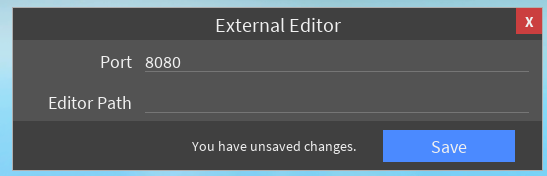
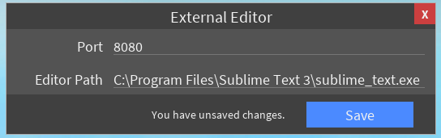

# Rbx-extedit
This is an external editor agent for ROBLOX Studio that allows you to open individual scripts in an external editor of your choice. It is designed to be easy to set up and get working.

## Installation

### From Binary
*Note: MacOS binaries are cross-compiled from Windows and are completely untested. They may not work.*

To install from the prebuilt binary releases:
* Get the [latest release](https://github.com/MemoryPenguin/rbx-exteditor/releases) that's suitable for your system. You'll need both the executable and the plugin.
* Install the plugin by placing it in your ROBLOX Studio Plugins folder.
	* You can open this from the plugins tab in Studio.
	* If you have Studio open when you do this, you'll need to reopen it for the plugin to load.
* Done! See [Usage](#Usage) for how to use the plugin.

### From Source
**TODO. tl;dr: the executable agent is written in Go; you'll need to build it that way.**

## Usage

### First-time Configuration
The first time you start using extedit, you'll need to configure your editor path. Find the executable path to the editor you want to use (if you have it in your PATH that's fine too). Copy this path to your clipboard.

Then, in Studio, look for the plugin's section in the plugins tab. Press the Configure button, which will open a GUI that looks like this at the bottom of your screen:

Paste the copied path into the Editor Path box, then press Save. You must save your changes in order for them to be applied!

It should now look something like this (your path may be different):

### Regular Use
Now that you've configured your editor path, you can open scripts in it. Select a script object and press Open Selection (in the same place that you found Configure). If your editor path is correct, the editor should open a file. You can edit this file, and when you save your changes, they'll appear in Studio. If you edit the script that you opened, those changes will appear in the file as well.